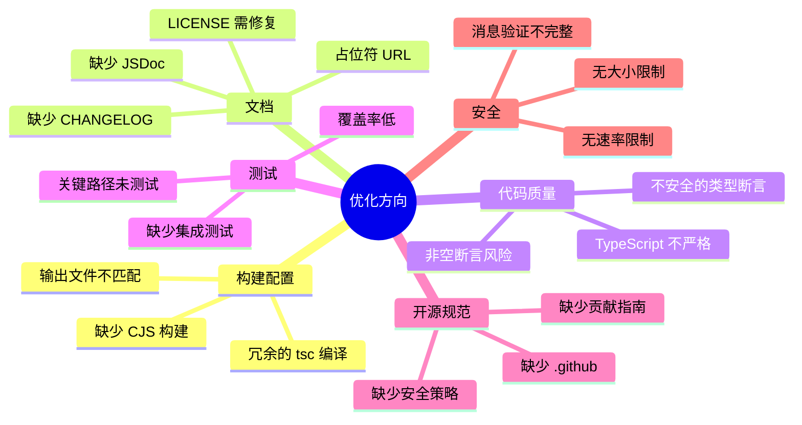

# PostMessage-Duplex 开源项目优化计划

## 问题概览



---

## 1. 构建配置修复 (Critical)

### 问题

- `package.json` 的 `exports` 指向 `dist/index.esm.js`，但 Rollup 输出 `dist/index.js`
- 缺少 CJS 格式构建（Node.js `require()` 需要）
- `build` 脚本运行 `tsc --module commonjs` 是冗余的

### 修复方案

**修改 [config/rollup.config.mjs](config/rollup.config.mjs)**：

```javascript
export default [
  // ESM build
  {
    input: 'src/index.ts',
    output: {
      file: 'dist/index.esm.js',  // 匹配 package.json module
      format: 'es',
      sourcemap: true
    },
    plugins: [/* ... */]
  },
  // CJS build
  {
    input: 'src/index.ts',
    output: {
      file: 'dist/index.cjs.js',  // CJS for require()
      format: 'cjs',
      sourcemap: true
    },
    plugins: [/* ... */]
  },
  // UMD build (browser)
  {
    input: 'src/index.ts',
    output: {
      file: 'dist/index.umd.js',
      format: 'umd',
      name: 'PostMessageChannel',
      sourcemap: true
    },
    plugins: [/* ... */]
  }
]
```

**更新 [package.json](package.json)**：

```json
{
  "main": "dist/index.cjs.js",
  "module": "dist/index.esm.js",
  "browser": "dist/index.umd.js",
  "exports": {
    ".": {
      "types": "./dist/index.d.ts",
      "import": "./dist/index.esm.js",
      "require": "./dist/index.cjs.js"
    }
  },
  "scripts": {
    "build": "rollup --config ./config/rollup.config.mjs"  // 移除冗余 tsc
  }
}
```

---

## 2. 文档完善 (Critical)

### 2.1 创建 CHANGELOG.md

```markdown
# Changelog

All notable changes to this project will be documented in this file.

The format is based on [Keep a Changelog](https://keepachangelog.com/en/1.0.0/),
and this project adheres to [Semantic Versioning](https://semver.org/spec/v2.0.0.html).

## [1.0.0] - 2026-01-26

### Added
- IframeChannel for iframe communication
- ServiceWorkerChannel for Service Worker communication
- Point-to-point communication with dual-layer validation
- Message tracing and debugging support
- TypeScript type definitions

### Security
- Origin validation for iframe messages
- Client ID validation for Service Worker messages
- Peer key validation for point-to-point communication
```

### 2.2 修复 LICENSE

```
Copyright 2020-2026 liquidliang

Licensed under the Apache License, Version 2.0 ...
```

### 2.3 修复 package.json 和 README 中的占位符 URL

将 `github.com/user/postmessage-duplex` 替换为实际的 GitHub 仓库地址。

### 2.4 添加公共 API 的 JSDoc

为 [src/base-channel.ts](src/base-channel.ts) 中的方法添加完整的 JSDoc：

```typescript
/**
 * Publishes a message to the remote channel and waits for response.
 * @param cmdname - The command name to identify the message type
 * @param data - Optional data payload to send
 * @returns Promise resolving to the response from the remote channel
 * @throws Will not throw, but returns error response with ret < 0 on failure
 * @example
 * const response = await channel.publish('getData', { id: 123 })
 * if (response.ret === ReturnCode.Success) {
 *   console.log(response.data)
 * }
 */
publish(cmdname: string, data?: Record<string, any>): Promise<PostResponse>
```

---

## 3. GitHub 开源规范 (High Priority)

### 3.1 创建 .github 目录结构

```
.github/
├── workflows/
│   └── ci.yml           # GitHub Actions CI
├── ISSUE_TEMPLATE/
│   ├── bug_report.md
│   └── feature_request.md
├── PULL_REQUEST_TEMPLATE.md
├── CONTRIBUTING.md
├── SECURITY.md
└── CODE_OF_CONDUCT.md
```

### 3.2 GitHub Actions CI

```yaml
# .github/workflows/ci.yml
name: CI
on: [push, pull_request]
jobs:
  test:
    runs-on: ubuntu-latest
    steps:
      - uses: actions/checkout@v4
      - uses: actions/setup-node@v4
        with:
          node-version: '20'
          cache: 'npm'
      - run: npm ci
      - run: npm run ci
```

### 3.3 CONTRIBUTING.md

包含：开发环境设置、代码规范、提交规范、PR 流程。

### 3.4 SECURITY.md

包含：安全漏洞报告方式、支持的版本、安全最佳实践。

---

## 4. TypeScript 严格模式 (High Priority)

### 修改 [tsconfig.json](tsconfig.json)

```json
{
  "compilerOptions": {
    "strict": true,
    "noImplicitAny": true,
    "strictNullChecks": true,
    "noUncheckedIndexedAccess": true,
    "isolatedModules": true
  }
}
```

### 修复类型问题

**[src/base-channel.ts](src/base-channel.ts)** 中的类型断言：

```typescript
// 当前（不安全）
callback.resolve(data as unknown as PostResponse)

// 修复：添加类型守卫
function isPostResponse(data: ChannelMessage): data is PostResponse {
  return 'ret' in data && typeof data.ret === 'number'
}

if (isPostResponse(data)) {
  callback.resolve(data)
}
```

**[src/iframe-channel.ts](src/iframe-channel.ts)** 中的非空断言：

```typescript
// 当前（风险）
this.iframe!.contentWindow!.postMessage(data, this.targetOrigin)

// 修复：添加空值检查
const contentWindow = this.iframe?.contentWindow
if (!contentWindow) {
  throw new Error('Iframe contentWindow is not available')
}
contentWindow.postMessage(data, this.targetOrigin)
```

---

## 5. 测试覆盖率提升 (High Priority)

### 当前状态

- 覆盖率阈值：branches 50%, functions 60%, lines 60%
- 缺少端到端通信测试
- 关键路径 `onMessage`、`sendRawMessage`、`isValidSource` 未测试

### 改进方案

**提升覆盖率阈值**：

```json
"coverageThreshold": {
  "global": {
    "branches": 80,
    "functions": 85,
    "lines": 85,
    "statements": 85
  }
}
```

**添加关键测试用例**：

```typescript
// test/base-channel.test.ts
describe('BaseChannel.onMessage', () => {
  it('应该正确处理响应消息并解析回调')
  it('应该在处理器成功时返回 Success')
  it('应该在处理器抛错时返回 ReceiverCallbackError')
  it('应该在收到 ready 消息时建立 peer 配对')
  it('应该忽略来自非配对通道的消息')
})

// test/integration.test.ts
describe('端到端通信', () => {
  it('父子 iframe 应该能完成消息往返')
  it('并发请求应该正确路由到对应回调')
  it('超时请求应该正确清理回调')
})
```

---

## 6. 安全加固 (Medium Priority)

### 6.1 消息大小限制

```typescript
// src/base-channel.ts
const MAX_MESSAGE_SIZE = 1024 * 1024 // 1MB

protected sendMessage(data: Record<string, any>): void {
  const serialized = JSON.stringify(data)
  if (serialized.length > MAX_MESSAGE_SIZE) {
    throw new Error(`Message size ${serialized.length} exceeds limit ${MAX_MESSAGE_SIZE}`)
  }
  // ...
}
```

### 6.2 速率限制

```typescript
// src/base-channel.ts
const RATE_LIMIT = 100 // messages per second
const RATE_WINDOW = 1000 // ms

protected messageTimestamps: number[] = []

protected checkRateLimit(): boolean {
  const now = Date.now()
  this.messageTimestamps = this.messageTimestamps.filter(t => now - t < RATE_WINDOW)
  if (this.messageTimestamps.length >= RATE_LIMIT) {
    this.log('warn', 'Rate limit exceeded')
    return false
  }
  this.messageTimestamps.push(now)
  return true
}
```

### 6.3 修复 ServiceWorkerChannel 页面端验证

```typescript
// src/sw-channel.ts
protected isValidSource(event: MessageEvent): boolean {
  if (this.isWorkerSide) {
    const source = event.source as unknown as ClientType
    return source?.id === this.clientId
  }
  // 页面端：验证消息来自 ServiceWorker
  return event.source === navigator.serviceWorker?.controller ||
         event.source === this.serviceWorker
}
```

---

## 7. 性能优化 (Medium Priority)

### 7.1 使用 URL API 替代 DOM 操作

```typescript
// src/url.ts (当前)
export function getLink(link: string): HTMLAnchorElement { ... }

// 修改为
export function parseUrl(link: string): URL {
  return new URL(link, window.location.origin)
}
```

### 7.2 可选的 JSON 克隆

```typescript
// src/iframe-channel.ts
protected sendRawMessage(data: Record<string, any>): void {
  if (this.isSon) {
    // 只在需要时进行 JSON 克隆（跨域场景）
    const clonedData = this.needsCloning ? JSON.parse(JSON.stringify(data)) : data
    window.parent.postMessage(clonedData, this.targetOrigin)
  }
  // ...
}
```

---

## 8. 代码质量改进 (Low Priority)

### 8.1 使用加密安全的随机 ID

```typescript
// src/base-channel.ts
export function generateUniqueId(prefix: string): string {
  const timestamp = Date.now().toString(36)
  const random = typeof crypto !== 'undefined' 
    ? Array.from(crypto.getRandomValues(new Uint8Array(8)))
        .map(b => b.toString(16).padStart(2, '0')).join('')
    : Math.floor(Math.random() * 1e16).toString(36)
  return `${prefix}${timestamp}${random}_`
}
```

### 8.2 添加 `once()` 方法

```typescript
// src/base-channel.ts
once(cmdname: string, callback: PostCallback): Communicator {
  const wrappedCallback: PostCallback = async (data) => {
    this.unSubscribe(cmdname)
    return callback(data)
  }
  return this.subscribe(cmdname, wrappedCallback)
}
```

### 8.3 `destroy()` 时拒绝待处理的 Promise

```typescript
destroy(): void {
  // 拒绝所有待处理的请求
  for (const [requestId, callback] of this.callbackMap) {
    callback.reject(new Error('Channel destroyed'))
  }
  // ... 其余清理代码
}
```

---

## 优先级矩阵

| 优先级 | 任务 | 影响 |

|--------|------|------|

| P0 | 修复构建输出配置 | 包发布后无法使用 |

| P0 | 创建 CHANGELOG.md | 开源规范要求 |

| P0 | 修复 LICENSE | 法律合规 |

| P1 | 修复占位符 URL | 项目可信度 |

| P1 | 添加 GitHub Actions CI | 代码质量保障 |

| P1 | 启用 TypeScript 严格模式 | 类型安全 |

| P2 | 添加 JSDoc | API 可用性 |

| P2 | 提升测试覆盖率 | 代码可靠性 |

| P2 | 添加 CONTRIBUTING.md | 社区贡献 |

| P3 | 安全加固 | 生产环境安全 |

| P3 | 性能优化 | 高并发场景 |