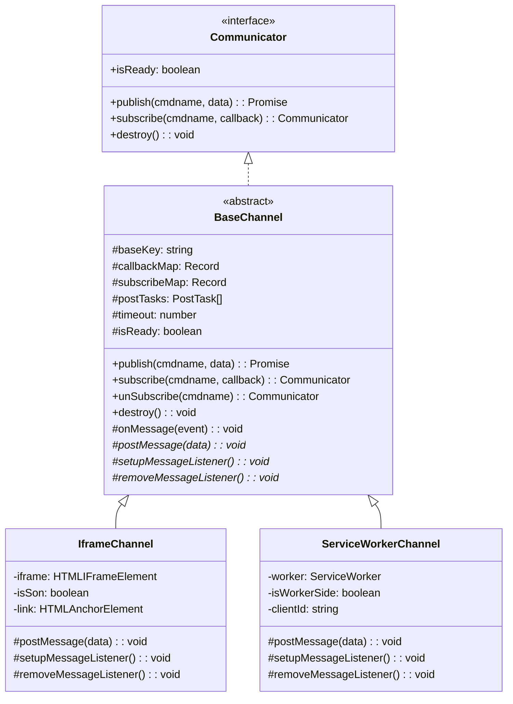

# PostMessage Channel 开源项目扩展计划

## 架构设计

通过继承模式实现代码复用，提取公共逻辑到抽象基类：



## 文件结构调整

```
src/
├── index.ts              # 统一导出入口
├── interface.ts          # 接口定义（保持不变）
├── base-channel.ts       # 新增：抽象基类
├── iframe-channel.ts     # 重构：从 index.ts 拆分
├── sw-channel.ts         # 新增：Service Worker 通道
├── trace.ts              # 调整：支持多通道类型
└── url.ts                # 保持不变
```

## 实现细节

### 1. 基类 `BaseChannel` ([src/base-channel.ts](src/base-channel.ts))

抽取以下公共逻辑：

- `callbackMap` / `subscribeMap` 管理
- `postTasks` 消息队列
- `timeout` 超时处理
- `publish()` / `subscribe()` / `unSubscribe()` / `destroy()` 方法
- `onMessage()` 消息处理核心逻辑
- 定义抽象方法：`postMessage()`、`setupMessageListener()`、`removeMessageListener()`

### 2. Iframe 通道 `IframeChannel` ([src/iframe-channel.ts](src/iframe-channel.ts))

从现有 [src/index.ts](src/index.ts) 拆分，保留 iframe 特定逻辑：

- `iframe` / `isSon` / `link` 属性
- 构造函数中的 origin 校验
- `postMessage()` 实现（使用 `parent.postMessage` 或 `iframe.contentWindow.postMessage`）
- `event.source` 校验逻辑

### 3. Service Worker 通道 `ServiceWorkerChannel` ([src/sw-channel.ts](src/sw-channel.ts))

新增类，支持两种场景：

**页面端（Main Thread）**：

```typescript
// 构造函数接收 ServiceWorker 实例
const channel = new ServiceWorkerChannel(navigator.serviceWorker.controller)
// postMessage 使用 worker.postMessage()
// 监听使用 navigator.serviceWorker.onmessage
```

**Service Worker 端**：

```typescript
// 构造函数接收 clientId 或 Client 对象
const channel = new ServiceWorkerChannel(clientId, { isWorkerSide: true })
// postMessage 使用 client.postMessage()
// 监听使用 self.onmessage
```

### 4. 入口文件调整 ([src/index.ts](src/index.ts))

```typescript
export { default as BaseChannel } from './base-channel'
export { default as IframeChannel } from './iframe-channel'
export { default as ServiceWorkerChannel } from './sw-channel'
export * from './interface'

// 向后兼容：默认导出 IframeChannel
import IframeChannel from './iframe-channel'
export default IframeChannel
```

## 开源项目完善

### package.json 调整

- 更新 `name` 为通用名称（如 `postmessage-channel`）
- 添加 `repository.url`
- 完善 `keywords`：`postmessage`, `iframe`, `service-worker`, `duplex`, `communication`

### README.md 更新

- 添加英文版说明
- 分场景展示使用示例（iframe / Service Worker）
- 添加 API 文档
- 添加 badges（npm version, license 等）

### 新增示例文件

- `sw-demo.html`：Service Worker 使用示例
- `sw.js`：示例 Service Worker 脚本